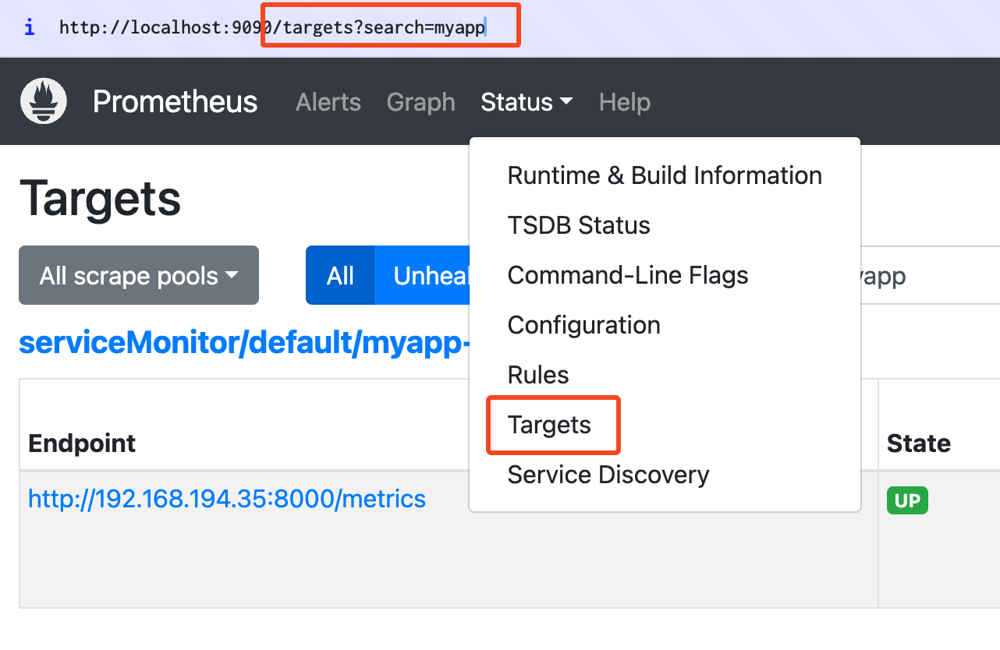
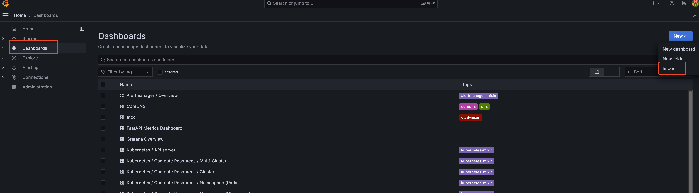
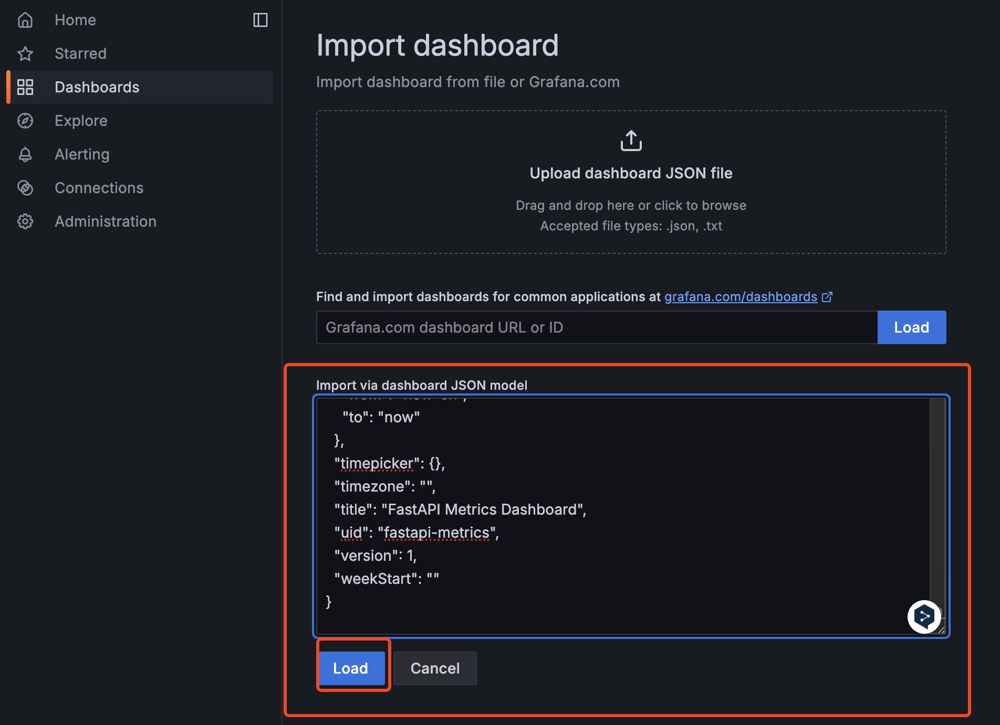
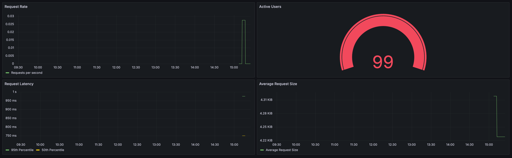

Custom Prometheus exporter를 만들고, Prometheus에 연동한 후 Grafana 대시보드로 시각화하는 과정을 연습한 것입니다. Prometheus와 Grafana는 kube-prometheus-stack을 사용했습니다.

## 사전 요구사항

- Docker Desktop 또는 OrbStack과 같은 로컬 Kubernetes 환경
- Helm

## Prometheus 및 Grafana 설치

1. Prometheus 커뮤니티 Helm 차트 저장소를 추가하고 업데이트합니다:

   ```bash
   helm repo add prometheus-community https://prometheus-community.github.io/helm-charts
   helm repo update
   ```

2. kube-prometheus-stack을 설치합니다:

   ```bash
   helm install prometheus prometheus-community/kube-prometheus-stack
   ```

3. Grafana의 관리자 비밀번호를 확인합니다:

   ```bash
   kubectl get secret prometheus-grafana -o jsonpath="{.data.admin-password}" | base64 --decode ; echo
   ```

## 애플리케이션 배포

1. 애플리케이션 이미지를 빌드합니다:

   ```bash
   docker build . -t myapp:dev
   ```

2. 애플리케이션을 Kubernetes에 배포합니다:

   ```bash
   kubectl apply -f myapp.yaml
   ```

## Prometheus 연결 확인

1. Prometheus를 포트 포워딩하여 접속합니다.

2. Targets 페이지에서 "myapp"을 검색하여 ServiceMonitor를 통해 잘 연결되었는지 확인합니다.



## Grafana 대시보드 생성

1. Grafana에 접속합니다.

2. `prometheus-metrics-dashboard.json` 파일을 이용하여 새 대시보드를 생성합니다.





## Metric 변하는 것 확인

1. myapp의 root에 접속한 후

2. grafana 대시보드를 새로고침 하면 값이 변경되는것을 확인합니다. (30초 주기로 변경 됨 myapp serviceMonitor의 interval)

## 참고 자료

- [kube-prometheus-stack GitHub 저장소](https://github.com/prometheus-community/helm-charts/tree/main/charts/kube-prometheus-stack)
